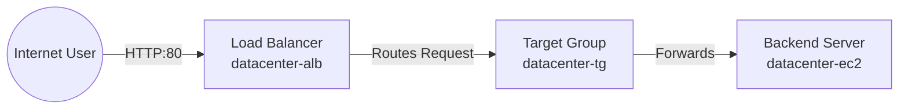

# Day 24: Application Load Balancer (ALB) Setup

## 📝 Task Details
The Nautilus DevOps team aims to decouple the user entry point from specific application servers to improve scalability and security. The goal is to place a Load Balancer in front of the existing web server.
* **Task:** Deploy an Application Load Balancer to route traffic to an EC2 instance.
* **ALB Name:** `datacenter-alb`
* **Target Group:** `datacenter-tg` (Port 80)
* **Security Group:** `datacenter-sg` (Port 80 open to public)
* **Backend:** `datacenter-ec2` (Existing Nginx server)

---

## 📚 Theory: Application Load Balancing
* **Application Load Balancer (ALB):** A Layer 7 load balancer that routes traffic based on content (HTTP/HTTPS). It serves as the single point of contact for clients.
* **Target Group:** A logical grouping of targets (instances, IPs, or Lambda functions). The ALB routes requests to the Target Group, which then distributes them to healthy registered targets.
* **Security Group Chaining:** A security best practice where the backend server's firewall (Security Group) only accepts traffic from the Load Balancer's Security Group, effectively hiding the server from the public internet.

### 🖼️ Architecture Flow

## ⚙️ Solution

### Step 1: Create Security Group for ALB
1. Navigated to EC2 > Security Groups.

2. Created a new Security Group named datacenter-sg.

3. Inbound Rules:

        Type: HTTP

        Port: 80

    Source: 0.0.0.0/0 (Anywhere).

    This allows the public to reach the Load Balancer.

### Step 2: Create Target Group
1. Navigated to EC2 > Load Balancing > Target Groups.

2. Created a Target Group named datacenter-tg.

    Settings:

        Target Type: Instances

        Protocol: HTTP

        Port: 80

3. Register Targets:

    Selected datacenter-ec2 from the list.

    Clicked Include as pending below and created the group.

### Step 3: Create Application Load Balancer
1. Navigated to EC2 > Load Balancing > Load Balancers.

2. Created an Application Load Balancer named datacenter-alb.

    Configuration:

        Scheme: Internet-facing (Public).

3. Mapping: Selected the VPC and at least two subnets (e.g., us-east-1a, us-east-1b).

4. Security Group: Attached datacenter-sg (created in Step 1).

5. Listeners: Configured Port 80 to forward to datacenter-tg (created in Step 2).

### Step 4: Configure Backend Security
1. Located the Security Group attached to the datacenter-ec2 instance.

2. Added an Inbound Rule to allow traffic from the Load Balancer.

        Type: HTTP

        Port: 80

3. Source: 0.0.0.0/0 (or the ID of datacenter-sg for stricter security).

## ✅ Verification
I verified the setup by accessing the Nginx page via the Load Balancer's DNS name.

### 1. Retrieve DNS Name:

```Bash

aws elbv2 describe-load-balancers \
    --names datacenter-alb \
    --query "LoadBalancers[0].DNSName" \
    --output text
```
### 2. Test Connection:

```Bash

curl http://<ALB-DNS-NAME>
```
Result: The command returned the HTML content of the "Welcome to nginx!" page, confirming that the ALB successfully received the request and forwarded it to the backend EC2 instance.
